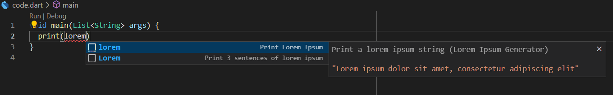
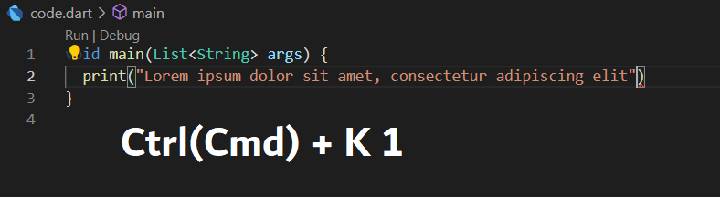
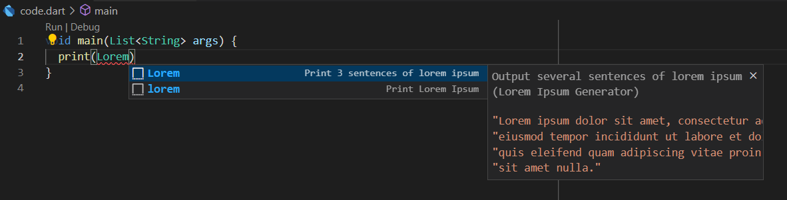

# lorem-ipsum-generator

###  An extension called from a code snippet that generate and paste the lorem ipsum text into a file

## Features

- Print a 'lorem ipsum' line by the `lorem` snippet or Keyboard Shortcut

    

    

- Print three sentences of 'lorem ipsum' by the `Lorem` snippet

    

## Requirements

The extension only works in `.dart` files

## Extension Improvement Proposals

- It would be great to add work via VSCode Command Pallete

## Author

- Aidar Nafikov M33051